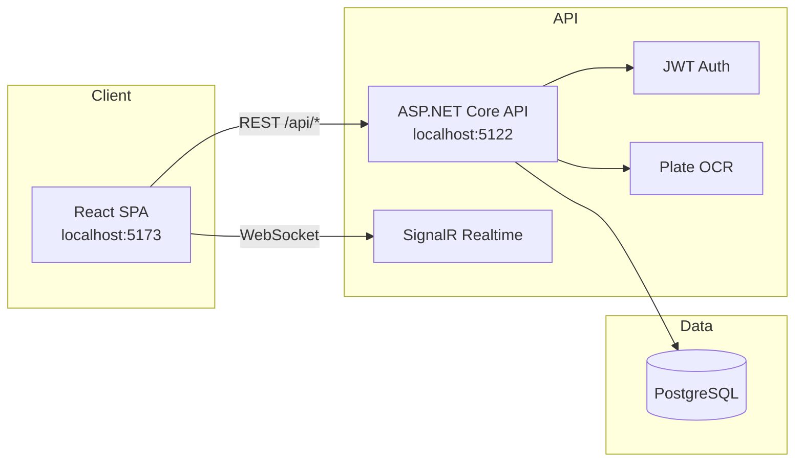

# Parking Building Management System (PBMS)

**Hệ thống quản lý bãi đỗ xe đa tầng** — dự án môn SWP391. Monorepo gồm giao diện web React, API ASP.NET Core, và PostgreSQL, hỗ trợ vận hành check-in/check-out, đặt chỗ, thu phí, quản trị theo vai trò, và tích hợp quét biển số.

| Thành phần | Công nghệ |
|------------|-----------|
| Frontend | React 18 · Vite 6 · TypeScript · Tailwind CSS · React Router 7 |
| Backend | ASP.NET Core 10 · Entity Framework Core · JWT · SignalR |
| Database | PostgreSQL 14+ |
| CI/CD | GitHub Actions · Railway (API) · Firebase Hosting (tùy chọn) |

---

## Mục lục

- [Tổng quan](#tổng-quan)
- [Tính năng theo vai trò](#tính-năng-theo-vai-trò)
- [Kiến trúc hệ thống](#kiến-trúc-hệ-thống)
- [Yêu cầu môi trường](#yêu-cầu-môi-trường)
- [Chạy local](#chạy-local)
- [Tài khoản demo](#tài-khoản-demo)
- [Cấu hình môi trường](#cấu-hình-môi-trường)
- [Kiểm thử](#kiểm-thử)
- [CI/CD & triển khai](#cicd--triển-khai)
- [Cấu trúc thư mục](#cấu-trúc-thư-mục)
- [Tài liệu tham chiếu](#tài-liệu-tham-chiếu)
- [Bảo mật](#bảo-mật)

---

## Tổng quan

PBMS mô phỏng vận hành một bãi đỗ xe trong tòa nhà: phân khu theo loại xe (xe máy, ô tô, EV), gán slot, tính phí theo chính sách giá, xử lý đặt chỗ trước, và ghi nhận sự cố. Luồng nghiệp vụ cốt lõi được bọc trong **transaction** để đảm bảo trạng thái slot và phiên đỗ xe nhất quán.

**Điểm nổi bật**

- Phân quyền **RBAC** bốn vai trò: Admin, Manager, Staff, Driver
- Check-in / check-out có tính phí, thanh toán (tiền mặt, chuyển khoản, ví điện tử — mô phỏng)
- Đặt chỗ, vé tháng (subscription), phản hồi tài xế, báo cáo và sự cố
- Quét biển số: camera + OCR (PaddleOCR backend, Plate Recognizer / Tesseract frontend)
- Đăng nhập Google cho **Driver**; Admin/Manager/Staff dùng tài khoản cấp sẵn (email/mật khẩu)
- Song ngữ **Tiếng Việt / English** trên giao diện tài xế và nhân viên

---

## Tính năng theo vai trò

| Vai trò | Portal | Chức năng chính |
|---------|--------|-----------------|
| **Admin** | `/admin` | Quản lý user, role, cấu hình hệ thống |
| **Manager** | `/manager` | Dashboard, slot map, giá, vé tháng, báo cáo, sự cố, phản hồi |
| **Staff** | `/staff-dashboard` | Check-in/out, quét biển số, xử lý sự cố, lịch sử xe |
| **Driver** | `/user-web`, `/user-mobile` | Đặt chỗ, vé tháng, ví, lịch sử, phản hồi; đăng ký / Google Sign-In |

**Quy tắc nghiệp vụ (tóm tắt)**

1. Một biển số chỉ có tối đa một phiên `Active` tại một thời điểm
2. Chỉ gán slot `Available` (hoặc `Reserved` hợp lệ khi check-in từ đặt chỗ)
3. Check-out: tính phí → tạo `Payment` → session `Completed` → slot `Available`

Chi tiết schema và workflow: [`database/PBMS_Database_Explanation_For_Agents.md`](database/PBMS_Database_Explanation_For_Agents.md)

---

## Kiến trúc hệ thống



**Luồng check-in (Staff)**

```text
Nhập / quét biển số → tra cứu session active
  → không có: gán slot Available → tạo ParkingSession (Active) → slot Occupied
  → có: check-out → tính phí → Payment → Completed → slot Available
```

---

## Yêu cầu môi trường

| Công cụ | Phiên bản gợi ý |
|---------|------------------|
| Node.js | 18+ (CI dùng 20) |
| npm | đi kèm Node |
| .NET SDK | 10.0.x |
| PostgreSQL | 14+ (local hoặc Docker) |
| Git | 2.x |

Tùy chọn: [Google Cloud Console](https://console.cloud.google.com/) (OAuth Web Client ID), [Plate Recognizer](https://platerecognizer.com/) (token ALPR miễn phí).

---

## Chạy local

### 1. Clone và chuẩn bị database

```bash
git clone https://github.com/KushinoAkira/Parking-Building-Management-System.git
cd Parking-Building-Management-System
```

Tạo database PostgreSQL tên `ParkingBuildingManagement` (hoặc chỉnh connection string).

### 2. Backend

```bash
cd backend/ParkingBuildingManagement.Api

# Sao chép và chỉnh mật khẩu / JWT (chỉ trên máy local)
# Tham chiếu: appsettings.example.json

dotnet ef database update
dotnet run
```

- API: `http://localhost:5122`
- Health: `GET /api/health`
- Seed tự chạy khi khởi động (user demo, zone, slot, giá mẫu)

### 3. Frontend

```bash
cd frontend
cp .env.example .env
npm install
npm run dev
```

- UI: `http://localhost:5173`
- Request `/api/*` được Vite proxy tới `http://localhost:5122` (hoặc dùng `VITE_API_BASE_URL`)

### 4. Chạy đồng thời (tóm tắt)

| Dịch vụ | URL | Lệnh |
|---------|-----|------|
| API | `:5122` | `dotnet run` trong `backend/ParkingBuildingManagement.Api` |
| Web | `:5173` | `npm run dev` trong `frontend` |

---

## Tài khoản demo

Tài khoản được seed khi API khởi động lần đầu (chỉ dùng **môi trường dev**):

| Vai trò | Email | Mật khẩu |
|---------|-------|----------|
| Admin | `admin@parking.com` | `Admin@123` |
| Manager | `manager@parking.com` | `Manager@123` |
| Staff | `staff@parking.com` | `Staff@123` |
| Driver | `user@parking.com` | `User@123` |

- **Admin / Manager / Staff:** chỉ đăng nhập email + mật khẩu (tài khoản cấp sẵn)
- **Driver:** có thể đăng ký mới hoặc đăng nhập Google (khi đã cấu hình `VITE_GOOGLE_CLIENT_ID` + `Google:ClientId`)

---

## Cấu hình môi trường

Chỉ dùng file **example** trong repo; giá trị thật đặt trên máy local hoặc biến môi trường deploy.

### Frontend — `frontend/.env`

| Biến | Bắt buộc | Mô tả |
|------|----------|-------|
| `VITE_API_BASE_URL` | Không (local) | URL API production; local để trống để dùng proxy |
| `VITE_GOOGLE_CLIENT_ID` | Tùy chọn | OAuth Web Client ID cho Google Sign-In (Driver) |
| `VITE_PLATE_RECOGNIZER_TOKEN` | Tùy chọn | Token ALPR; không có vẫn quét được qua OCR local |

Mẫu: [`frontend/.env.example`](frontend/.env.example)

### Backend — `appsettings.Development.json` (local, gitignored) hoặc User Secrets

| Khóa | Mô tả |
|------|-------|
| `ConnectionStrings:DefaultConnection` | Chuỗi PostgreSQL |
| `Jwt:Secret` | Khóa ký JWT (≥ 32 ký tự) |
| `Google:ClientId` | Xác thực Google ID token |
| `PayOs:*` | Cổng thanh toán (demo mode mặc định) |
| `Ocr:Model` | Mô hình PaddleOCR |

Mẫu: [`backend/ParkingBuildingManagement.Api/appsettings.example.json`](backend/ParkingBuildingManagement.Api/appsettings.example.json)

---

## Kiểm thử

```bash
# Backend — unit + integration tests
cd backend
dotnet test ParkingBuildingManagement.slnx --configuration Release

# Frontend — Vitest
cd frontend
npm run typecheck
npm test

# E2E — Playwright (cần FE + BE đang chạy)
cd frontend
npm run test:e2e
```

---

## CI/CD & triển khai

GitHub Actions chạy trên **push** và **pull request** vào `main` / `dev`:

| Workflow | Jobs | Mục đích |
|----------|------|----------|
| [`ci.yml`](.github/workflows/ci.yml) | `frontend-build`, `backend-build` | Typecheck, test, build |
| [`security-scan.yml`](.github/workflows/security-scan.yml) | `secret-scan` | Gitleaks — quét secret trong repo |
| [`deploy.yml`](.github/workflows/deploy.yml) | verify → Railway / Firebase | Triển khai sau merge `main` |

**Checklist trước khi merge PR**

- [ ] `frontend-build` pass
- [ ] `backend-build` pass
- [ ] `secret-scan` pass
- [ ] Không có `.env`, mật khẩu thật, hay key production trong diff

Hướng dẫn deploy Railway + Firebase: [`docs/deploy-cicd.md`](docs/deploy-cicd.md)

---

## Cấu trúc thư mục

```text
Parking-Building-Management-System/
├── frontend/                 # React SPA (Vite)
│   ├── src/app/
│   │   ├── components/       # UI theo role (Staff, Manager, Driver, …)
│   │   ├── lib/              # API client, auth, i18n, OCR helpers
│   │   └── routes.tsx
│   └── e2e/                  # Playwright smoke tests
├── backend/
│   ├── ParkingBuildingManagement.Api/   # Web API, services, EF migrations
│   └── ParkingBuildingManagement.Api.Tests/
├── database/
│   ├── pbms-schema.dbml      # ERD tham chiếu
│   └── PBMS_Database_Explanation_For_Agents.md
├── docs/                     # Deploy, diagram, tài liệu nội bộ
├── .github/workflows/        # CI, security scan, deploy
├── Dockerfile                # Build monorepo cho Railway
└── README.md
```

**API modules (REST)**

`auth` · `users` · `roles` · `facility` · `vehicle-types` · `zones` · `slots` · `pricing` · `reservations` · `parking-sessions` · `payments` · `subscriptions` · `incidents` · `feedbacks` · `reports` · `system-configs` · `plate-ocr` · `portal`

---

## Tài liệu tham chiếu

| Tài liệu | Nội dung |
|----------|----------|
| [`database/pbms-schema.dbml`](database/pbms-schema.dbml) | Sơ đồ bảng (DBML) |
| [`database/PBMS_Database_Explanation_For_Agents.md`](database/PBMS_Database_Explanation_For_Agents.md) | Thiết kế DB, workflow, mapping UI |
| [`docs/deploy-cicd.md`](docs/deploy-cicd.md) | Biến môi trường và pipeline deploy |
| [`docs/railway-quickstart.md`](docs/railway-quickstart.md) | Railway quickstart |

---

## Bảo mật

- **Không commit** `.env`, `appsettings.Development.json` có mật khẩu thật, JWT secret, hay API key production
- Chỉ đẩy placeholder trong `*.example` / `appsettings.example.json`
- Secret production: Railway Variables, Firebase, hoặc User Secrets local
- Nếu secret đã lộ: rotate ngay và xóa khỏi lịch sử Git nếu repo public

Trước mỗi commit:

```bash
git diff --cached
# Kiểm tra không có Password=, JWT secret thật, token thật
```

---

## Git workflow (tóm tắt)

- Nhánh bảo vệ: `main`, `dev` — không push trực tiếp lên `main`
- Feature: `feature/<slug>-<tên-ngắn>`
- Merge qua **Pull Request** trên GitHub; CI phải xanh trước khi merge

---

## License

Dự án học thuật SWP391 — sử dụng theo quy định của nhóm / môn học.
