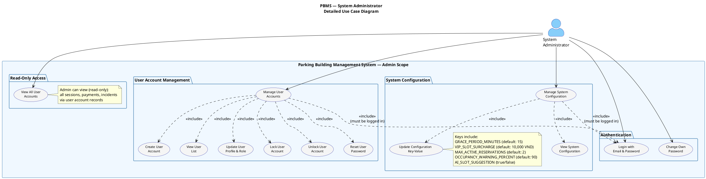
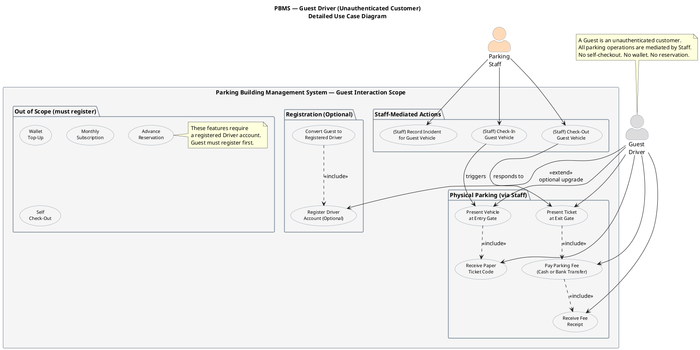
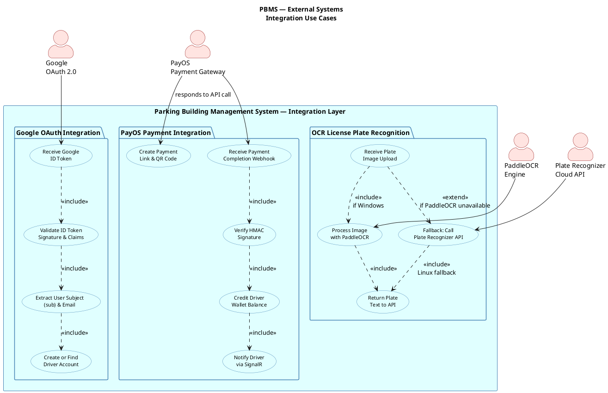
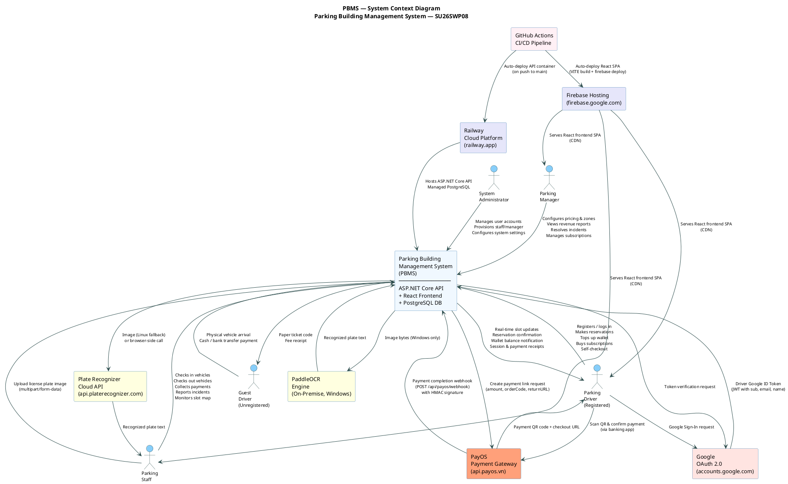
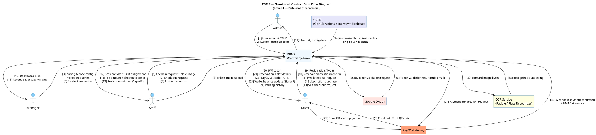

# UML DIAGRAMS

## Parking Building Management System (PBMS)

---

| Document Information | |
|---|---|
| **Project Code** | SU26SWP08 |
| **Document Type** | UML Diagrams — Use Case + Context |
| **UML Version** | UML 2.x |
| **Version** | 1.0 |
| **Prepared By** | SU26SWP08 Development Team |
| **Tool Format** | PlantUML |

---

## 1. ACTOR IDENTIFICATION

| Actor | Type | Scope and Entitlements |
|---|---|---|
| **System Administrator (Admin)** | Internal | Account provisioning; system parameter configuration. |
| **Parking Facility Manager (Manager)** | Internal | Tariff policy control; space logic definition; financial oversight. |
| **Parking Staff (Staff)** | Internal | Vehicle throughput handling; operational ticket logging. |
| **Parking Driver (Driver)** | External | Advance reservation logic; wallet initialization and top-ups. |
| **Guest Driver** | External | Physical flow engagement; anonymous checkout. |
| **Google OAuth** | External System | Federated authentication broker (ID token emission). |
| **PayOS** | External System | Transaction verification and webhook origin. |
| **PaddleOCR Engine** | External System | Localized plate image extraction server. |
| **Plate Recognizer API** | External System | Secondary web-based plate validation fallback. |

---

---

## 2. OVERALL USE CASE LIST

| UC ID | Use Case Name | Actor(s) | Module |
|---|---|---|---|
| UC-01 | Login with Email & Password | Admin, Manager, Staff, Driver | Authentication |
| UC-02 | Login / Register with Google OAuth | Driver | Authentication |
| UC-03 | Register Driver Account | Driver | Authentication |
| UC-04 | Change Password | Admin, Manager, Staff, Driver | Authentication |
| UC-05 | Link Google Account | Driver | Authentication |
| UC-06 | Manage User Accounts | Admin | User Management |
| UC-07 | Reset User Password | Admin | User Management |
| UC-08 | Lock / Unlock User Account | Admin | User Management |
| UC-09 | Manage System Configuration | Admin | System Config |
| UC-10 | Manage Parking Facility Info | Manager | Facility Setup |
| UC-11 | Manage Vehicle Types | Manager | Facility Setup |
| UC-12 | Manage Pricing Policies | Manager | Pricing |
| UC-13 | Manage Parking Zones | Manager | Facility Setup |
| UC-14 | Manage Parking Slots | Manager | Facility Setup |
| UC-15 | Manage Subscription Plans | Manager | Subscription |
| UC-16 | Perform Vehicle Check-In | Staff | Parking Operations |
| UC-17 | Recognize License Plate via OCR | Staff | Parking Operations |
| UC-18 | Perform Vehicle Check-Out | Staff, Driver | Parking Operations |
| UC-19 | Calculate Parking Fee | System | Parking Operations |
| UC-20 | Process Wallet Payment | System | Payment |
| UC-21 | View Real-Time Slot Map | Staff, Manager, Driver | Parking Operations |
| UC-22 | Create Advance Reservation | Driver | Reservation |
| UC-23 | Confirm Reservation | Driver, Staff | Reservation |
| UC-24 | Cancel Reservation | Driver, Staff | Reservation |
| UC-25 | Top Up Digital Wallet | Driver | Wallet |
| UC-26 | View Wallet Balance & History | Driver | Wallet |
| UC-27 | Purchase Monthly Subscription | Driver | Subscription |
| UC-28 | Cancel Subscription | Driver | Subscription |
| UC-29 | View Own Parking History | Driver | Self-Service |
| UC-30 | Submit Parking Feedback | Driver | Self-Service |
| UC-31 | View Driver Notifications | Driver | Self-Service |
| UC-32 | Create Incident Record | Staff | Incident Management |
| UC-33 | Resolve / Cancel Incident | Manager | Incident Management |
| UC-34 | Review Incident Queue | Manager, Staff | Incident Management |
| UC-35 | View Manager Dashboard | Manager | Analytics |
| UC-36 | View Revenue Reports | Manager | Analytics |
| UC-37 | View Session Statistics | Manager | Analytics |
| UC-38 | View Zone Occupancy Report | Manager | Analytics |
| UC-39 | Generate Daily Report Snapshot | Manager | Analytics |
| UC-40 | View Staff Operations Overview | Staff | Monitoring |
| UC-41 | Process PayOS Payment Webhook | PayOS, System | Payment Integration |
| UC-42 | Validate Google ID Token | Google OAuth, System | Auth Integration |

---

## 3. OVERALL USE CASE DIAGRAM

```plantuml
@startuml PBMS_Overall_Use_Case_Diagram
!pragma useNewPackage

skinparam actorStyle awesome
skinparam packageStyle rectangle
skinparam usecase {
  BackgroundColor WhiteSmoke
  BorderColor DarkSlateGray
  FontColor Black
  FontSize 11
}
skinparam actor {
  BackgroundColor LightSteelBlue
  BorderColor DarkSlateGray
  FontSize 11
}
skinparam arrow {
  Color DarkSlateGray
  FontSize 10
}
skinparam package {
  BackgroundColor AliceBlue
  BorderColor SteelBlue
}
skinparam note {
  BackgroundColor LightYellow
  BorderColor DimGray
}

title PBMS — Overall System Use Case Diagram\nParking Building Management System — SU26SWP08

'─────────────────────────────────────────────
' ACTORS (left side — human)
'─────────────────────────────────────────────
actor "System\nAdministrator" as Admin #LightSkyBlue
actor "Parking\nManager" as Manager #LightSkyBlue
actor "Parking\nStaff" as Staff #LightSkyBlue
actor "Parking\nDriver" as Driver #LightGreen
actor "Guest\nDriver" as Guest #LightGreen

'─────────────────────────────────────────────
' ACTORS (right side — external systems)
'─────────────────────────────────────────────
actor "Google\nOAuth" as GoogleOAuth #MistyRose
actor "PayOS\nPayment Gateway" as PayOS #MistyRose
actor "OCR Engine\n(PaddleOCR)" as OCR #MistyRose
actor "Plate Recognizer\nAPI" as PlateRec #MistyRose

'─────────────────────────────────────────────
' ACTOR GENERALIZATION
'─────────────────────────────────────────────
Guest --|> Driver : <<generalization>>

rectangle "Parking Building Management System" {

  '─────────────────────────────
  ' MODULE: Authentication
  '─────────────────────────────
  package "Authentication" {
    usecase "Login with\nEmail & Password" as UC_Login
    usecase "Register Driver\nAccount" as UC_Register
    usecase "Login with\nGoogle OAuth" as UC_GoogleLogin
    usecase "Change Password" as UC_ChangePass
    usecase "Link Google\nAccount" as UC_LinkGoogle
  }

  '─────────────────────────────
  ' MODULE: User & System Admin
  '─────────────────────────────
  package "User & System Administration" {
    usecase "Manage User\nAccounts" as UC_ManageUsers
    usecase "Lock / Unlock\nUser Account" as UC_LockUser
    usecase "Reset User\nPassword" as UC_ResetPass
    usecase "Manage System\nConfiguration" as UC_SystemConfig
  }

  '─────────────────────────────
  ' MODULE: Facility & Pricing
  '─────────────────────────────
  package "Facility & Pricing Management" {
    usecase "Manage Parking\nFacility Info" as UC_Facility
    usecase "Manage Pricing\nPolicies" as UC_Pricing
    usecase "Manage Parking\nZones & Slots" as UC_Zones
    usecase "Manage Subscription\nPlans" as UC_ManagePlans
  }

  '─────────────────────────────
  ' MODULE: Parking Operations
  '─────────────────────────────
  package "Parking Operations" {
    usecase "Perform Vehicle\nCheck-In" as UC_CheckIn
    usecase "Perform Vehicle\nCheck-Out" as UC_CheckOut
    usecase "Calculate\nParking Fee" as UC_CalcFee
    usecase "Recognize License\nPlate via OCR" as UC_OCR
    usecase "View Real-Time\nSlot Map" as UC_SlotMap
  }

  '─────────────────────────────
  ' MODULE: Reservation
  '─────────────────────────────
  package "Reservation Management" {
    usecase "Create Advance\nReservation" as UC_CreateRes
    usecase "Confirm\nReservation" as UC_ConfirmRes
    usecase "Cancel\nReservation" as UC_CancelRes
  }

  '─────────────────────────────
  ' MODULE: Payment & Wallet
  '─────────────────────────────
  package "Payment & Wallet" {
    usecase "Top Up\nDigital Wallet" as UC_TopUp
    usecase "Process Wallet\nPayment" as UC_WalletPay
    usecase "Receive PayOS\nWebhook" as UC_Webhook
    usecase "View Wallet\nBalance & History" as UC_WalletView
  }

  '─────────────────────────────
  ' MODULE: Subscription
  '─────────────────────────────
  package "Subscription" {
    usecase "Purchase Monthly\nSubscription" as UC_BuySub
    usecase "Cancel\nSubscription" as UC_CancelSub
  }

  '─────────────────────────────
  ' MODULE: Incident Management
  '─────────────────────────────
  package "Incident Management" {
    usecase "Create Incident\nRecord" as UC_CreateInc
    usecase "Resolve / Cancel\nIncident" as UC_ResolveInc
    usecase "Review Incident\nQueue" as UC_ReviewInc
  }

  '─────────────────────────────
  ' MODULE: Driver Self-Service
  '─────────────────────────────
  package "Driver Self-Service" {
    usecase "View Own Parking\nHistory" as UC_History
    usecase "Submit Parking\nFeedback" as UC_Feedback
    usecase "View Driver\nNotifications" as UC_Notif
  }

  '─────────────────────────────
  ' MODULE: Analytics & Reports
  '─────────────────────────────
  package "Analytics & Reporting" {
    usecase "View Manager\nDashboard" as UC_Dashboard
    usecase "View Revenue\nReports" as UC_Revenue
    usecase "View Zone\nOccupancy Report" as UC_Occupancy
    usecase "View Session\nStatistics" as UC_SessionStats
    usecase "Generate Daily\nReport Snapshot" as UC_Snapshot
    usecase "View Staff\nOperations Overview" as UC_StaffOverview
  }

}

'─────────────────────────────────────────────
' ASSOCIATIONS — Admin
'─────────────────────────────────────────────
Admin --> UC_Login
Admin --> UC_ManageUsers
Admin --> UC_LockUser
Admin --> UC_ResetPass
Admin --> UC_SystemConfig
Admin --> UC_ChangePass

'─────────────────────────────────────────────
' ASSOCIATIONS — Manager
'─────────────────────────────────────────────
Manager --> UC_Login
Manager --> UC_Facility
Manager --> UC_Pricing
Manager --> UC_Zones
Manager --> UC_ManagePlans
Manager --> UC_SlotMap
Manager --> UC_ResolveInc
Manager --> UC_ReviewInc
Manager --> UC_Dashboard
Manager --> UC_Revenue
Manager --> UC_Occupancy
Manager --> UC_SessionStats
Manager --> UC_Snapshot
Manager --> UC_ChangePass

'─────────────────────────────────────────────
' ASSOCIATIONS — Staff
'─────────────────────────────────────────────
Staff --> UC_Login
Staff --> UC_CheckIn
Staff --> UC_CheckOut
Staff --> UC_SlotMap
Staff --> UC_CreateInc
Staff --> UC_ReviewInc
Staff --> UC_ConfirmRes
Staff --> UC_CancelRes
Staff --> UC_StaffOverview
Staff --> UC_ChangePass

'─────────────────────────────────────────────
' ASSOCIATIONS — Driver
'─────────────────────────────────────────────
Driver --> UC_Register
Driver --> UC_GoogleLogin
Driver --> UC_Login
Driver --> UC_ChangePass
Driver --> UC_LinkGoogle
Driver --> UC_CreateRes
Driver --> UC_ConfirmRes
Driver --> UC_CancelRes
Driver --> UC_TopUp
Driver --> UC_WalletView
Driver --> UC_WalletPay
Driver --> UC_BuySub
Driver --> UC_CancelSub
Driver --> UC_CheckOut
Driver --> UC_History
Driver --> UC_Feedback
Driver --> UC_Notif
Driver --> UC_SlotMap

'─────────────────────────────────────────────
' ASSOCIATIONS — External Systems
'─────────────────────────────────────────────
GoogleOAuth --> UC_GoogleLogin
PayOS --> UC_Webhook
OCR --> UC_OCR
PlateRec --> UC_OCR

'─────────────────────────────────────────────
' INCLUDE RELATIONSHIPS (mandatory sub-processes)
'─────────────────────────────────────────────
UC_CheckIn ..> UC_OCR : <<include>>\n(optional auto-scan)
UC_CheckIn ..> UC_CalcFee : <<include>>\nestimate fee
UC_CheckOut ..> UC_CalcFee : <<include>>\nfinal fee
UC_BuySub ..> UC_WalletPay : <<include>>\ndeduct balance
UC_TopUp ..> UC_Webhook : <<include>>\n(async complete)
UC_GoogleLogin ..> UC_Register : <<include>>\nif new account

'─────────────────────────────────────────────
' EXTEND RELATIONSHIPS (conditional sub-processes)
'─────────────────────────────────────────────
UC_CheckOut ..> UC_WalletPay : <<extend>>\nif paymentMethod=EWallet
UC_CalcFee ..> UC_BuySub : <<extend>>\nif active subscription→fee=0
UC_CheckIn ..> UC_ConfirmRes : <<extend>>\nif reservation provided
UC_OCR ..> PlateRec : <<extend>>\nif server OCR unavailable\n(Linux/fallback)

@enduml
```



---

## 4. DETAILED USE CASE DIAGRAMS — BY ACTOR

---

### 4.1 System Administrator (Admin) — Detailed Use Case Diagram



---

### 4.2 Parking Facility Manager — Detailed Use Case Diagram

```plantuml
@startuml PBMS_Manager_Use_Case

skinparam actorStyle awesome
skinparam usecase {
  BackgroundColor WhiteSmoke
  BorderColor DarkGreen
  FontSize 11
}
skinparam actor {
  BackgroundColor PaleGreen
  BorderColor DarkGreen
}
skinparam package {
  BackgroundColor HoneyDew
  BorderColor SeaGreen
}

title PBMS — Parking Facility Manager\nDetailed Use Case Diagram

actor "Parking\nManager" as Manager #PaleGreen

rectangle "Parking Building Management System — Manager Scope" {

  package "Authentication" {
    usecase "Login with\nEmail & Password" as UC_Login
    usecase "Change Own\nPassword" as UC_ChangePass
  }

  package "Facility & Infrastructure Setup" {
    usecase "Manage Parking\nFacility Info" as UC_Facility
    usecase "Update Facility\nOpen / Close Time" as UC_OpenTime
    usecase "Set Facility\nOperational Status" as UC_FacilityStatus

    usecase "Manage Parking\nZones" as UC_ManageZones
    usecase "Create Parking\nZone" as UC_CreateZone
    usecase "View All\nZones" as UC_ViewZones
    usecase "Update Zone\nStatus" as UC_UpdateZone

    usecase "Manage Parking\nSlots" as UC_ManageSlots
    usecase "View Slot\nDetails" as UC_ViewSlot
    usecase "Set Slot to\nMaintenance" as UC_SlotMaint
    usecase "Lock / Unlock\nSlot" as UC_LockSlot

    UC_Facility ..> UC_OpenTime       : <<include>>
    UC_Facility ..> UC_FacilityStatus : <<include>>

    UC_ManageZones ..> UC_CreateZone  : <<include>>
    UC_ManageZones ..> UC_ViewZones   : <<include>>
    UC_ManageZones ..> UC_UpdateZone  : <<include>>

    UC_ManageSlots ..> UC_ViewSlot    : <<include>>
    UC_ManageSlots ..> UC_SlotMaint   : <<include>>
    UC_ManageSlots ..> UC_LockSlot    : <<include>>
  }

  package "Pricing Management" {
    usecase "Manage Pricing\nPolicies" as UC_ManagePricing
    usecase "View Active\nPricing Policies" as UC_ViewPricing
    usecase "Create New\nPricing Policy" as UC_CreatePolicy
    usecase "Deactivate Old\nPricing Policy" as UC_DeactivatePolicy

    UC_ManagePricing ..> UC_ViewPricing       : <<include>>
    UC_ManagePricing ..> UC_CreatePolicy      : <<include>>
    UC_ManagePricing ..> UC_DeactivatePolicy  : <<include>>

    note right of UC_CreatePolicy
      Creates policy for a vehicle type:
      - PricePerHour (VND)
      - DailyMaxFee
      - LostTicketFee
      - OvertimeFee
      Sets previous Active policy → Inactive
    end note
  }

  package "Subscription Plan Management" {
    usecase "Manage Subscription\nPlans" as UC_ManagePlans
    usecase "Create Subscription\nPlan" as UC_CreatePlan
    usecase "Update Subscription\nPlan" as UC_UpdatePlan
    usecase "Deactivate\nSubscription Plan" as UC_DeactivatePlan

    UC_ManagePlans ..> UC_CreatePlan    : <<include>>
    UC_ManagePlans ..> UC_UpdatePlan    : <<include>>
    UC_ManagePlans ..> UC_DeactivatePlan : <<include>>
  }

  package "Incident Management" {
    usecase "Review Incident\nQueue" as UC_ReviewInc
    usecase "Resolve\nIncident" as UC_ResolveInc
    usecase "Cancel\nIncident" as UC_CancelInc
    usecase "Filter Incidents\nby Status" as UC_FilterInc

    UC_ReviewInc ..> UC_FilterInc   : <<include>>
    UC_ResolveInc ..> UC_ReviewInc  : <<include>>
    UC_CancelInc  ..> UC_ReviewInc  : <<include>>
  }

  package "Real-Time Monitoring" {
    usecase "View Real-Time\nSlot Map" as UC_SlotMap
    usecase "View Manager\nDashboard" as UC_Dashboard

    note right of UC_Dashboard
      Displays live KPIs:
      - Active sessions count
      - Today's revenue (VND)
      - Occupancy rate (%)
      - Open incidents count
      - Pending reservations count
    end note
  }

  package "Analytics & Reporting" {
    usecase "View Revenue\nTrend Chart" as UC_Revenue
    usecase "View Session\nStatistics" as UC_SessionStats
    usecase "View Zone\nOccupancy Report" as UC_Occupancy
    usecase "Generate Daily\nReport Snapshot" as UC_Snapshot
    usecase "Query Historical\nSnapshots" as UC_QuerySnap

    UC_Snapshot    ..> UC_QuerySnap  : <<extend>>\nafter generation
  }

}

' Associations
Manager --> UC_Login
Manager --> UC_ChangePass
Manager --> UC_Facility
Manager --> UC_ManageZones
Manager --> UC_ManageSlots
Manager --> UC_ManagePricing
Manager --> UC_ManagePlans
Manager --> UC_ReviewInc
Manager --> UC_ResolveInc
Manager --> UC_CancelInc
Manager --> UC_SlotMap
Manager --> UC_Dashboard
Manager --> UC_Revenue
Manager --> UC_SessionStats
Manager --> UC_Occupancy
Manager --> UC_Snapshot

@enduml
```



---

### 4.3 Parking Staff — Detailed Use Case Diagram

```plantuml
@startuml PBMS_Staff_Use_Case

skinparam actorStyle awesome
skinparam usecase {
  BackgroundColor WhiteSmoke
  BorderColor DarkOrange
  FontSize 11
}
skinparam actor {
  BackgroundColor PeachPuff
  BorderColor DarkOrange
}
skinparam package {
  BackgroundColor OldLace
  BorderColor DarkOrange
}

title PBMS — Parking Staff\nDetailed Use Case Diagram

actor "Parking\nStaff" as Staff #PeachPuff
actor "OCR Engine\n(PaddleOCR)" as OCR #MistyRose
actor "Plate Recognizer\nAPI" as PlateRec #MistyRose

rectangle "Parking Building Management System — Staff Scope" {

  package "Authentication" {
    usecase "Login with\nEmail & Password" as UC_Login
    usecase "Change Own\nPassword" as UC_ChangePass
  }

  package "Vehicle Check-In Operations" {
    usecase "Perform Vehicle\nCheck-In" as UC_CheckIn
    usecase "Enter License\nPlate Manually" as UC_ManualPlate
    usecase "Scan License Plate\nvia OCR Camera" as UC_OCRScan
    usecase "Select Vehicle\nType" as UC_SelectType
    usecase "Link to Existing\nReservation" as UC_LinkRes
    usecase "Auto-Allocate\nParking Slot" as UC_AutoAlloc
    usecase "Override Slot\nSelection" as UC_ManualSlot

    UC_CheckIn ..> UC_SelectType  : <<include>>
    UC_CheckIn ..> UC_AutoAlloc   : <<include>>
    UC_CheckIn ..> UC_ManualPlate : <<include>>
    UC_OCRScan  ..> UC_CheckIn    : <<extend>>\nauto-fill plate
    UC_LinkRes  ..> UC_CheckIn    : <<extend>>\nif reservation present
    UC_ManualSlot ..> UC_CheckIn  : <<extend>>\nif staff overrides
  }

  package "Vehicle Check-Out Operations" {
    usecase "Perform Vehicle\nCheck-Out" as UC_CheckOut
    usecase "Search Session\nby Ticket Code" as UC_SearchTicket
    usecase "Search Session\nby License Plate" as UC_SearchPlate
    usecase "Preview\nParking Fee" as UC_PreviewFee
    usecase "Collect Cash\nPayment" as UC_Cash
    usecase "Confirm Bank\nTransfer Payment" as UC_BankTransfer
    usecase "Process EWallet\nDeduction" as UC_EWallet
    usecase "Apply Lost\nTicket Penalty" as UC_LostTicket

    UC_CheckOut ..> UC_PreviewFee     : <<include>>
    UC_CheckOut ..> UC_SearchTicket   : <<include>>
    UC_Cash       ..> UC_CheckOut     : <<extend>>\nif method=Cash
    UC_BankTransfer ..> UC_CheckOut   : <<extend>>\nif method=BankTransfer
    UC_EWallet    ..> UC_CheckOut     : <<extend>>\nif method=EWallet
    UC_LostTicket ..> UC_PreviewFee   : <<extend>>\nif lost ticket flag
    UC_SearchPlate ..> UC_CheckOut    : <<extend>>\nalternative search
  }

  package "Real-Time Monitoring" {
    usecase "View Real-Time\nSlot Map" as UC_SlotMap
    usecase "View Slot\nDetail on Click" as UC_SlotDetail
    usecase "Trigger Check-Out\nfrom Slot Map" as UC_SlotCheckOut
    usecase "View Staff\nOperations Overview" as UC_Overview

    UC_SlotDetail   ..> UC_SlotMap      : <<include>>
    UC_SlotCheckOut ..> UC_SlotDetail   : <<extend>>
  }

  package "Reservation Queue" {
    usecase "View Upcoming\nReservations" as UC_ViewRes
    usecase "Confirm Driver\nReservation" as UC_ConfirmRes
    usecase "Cancel Driver\nReservation" as UC_CancelRes
  }

  package "Incident Reporting" {
    usecase "Create Incident\nRecord" as UC_CreateInc
    usecase "Select Incident\nType" as UC_SelectIncType
    usecase "Set Penalty\nFee" as UC_SetPenalty
    usecase "Link Incident\nto Session" as UC_LinkSession
    usecase "View Open\nIncidents" as UC_ViewInc

    UC_CreateInc ..> UC_SelectIncType : <<include>>
    UC_CreateInc ..> UC_SetPenalty    : <<include>>
    UC_CreateInc ..> UC_LinkSession   : <<include>>
  }

  package "Session History" {
    usecase "View Session\nHistory" as UC_History
    usecase "Filter Sessions\nby Date Range" as UC_FilterHistory

    UC_History ..> UC_FilterHistory : <<include>>
  }

}

' Associations
Staff --> UC_Login
Staff --> UC_ChangePass
Staff --> UC_CheckIn
Staff --> UC_OCRScan
Staff --> UC_CheckOut
Staff --> UC_SlotMap
Staff --> UC_Overview
Staff --> UC_ViewRes
Staff --> UC_ConfirmRes
Staff --> UC_CancelRes
Staff --> UC_CreateInc
Staff --> UC_ViewInc
Staff --> UC_History

OCR --> UC_OCRScan
PlateRec --> UC_OCRScan : <<extend>>\n(Linux fallback)

@enduml
```



---

### 4.4 Parking Driver — Detailed Use Case Diagram

```plantuml
@startuml PBMS_Driver_Use_Case

skinparam actorStyle awesome
skinparam usecase {
  BackgroundColor WhiteSmoke
  BorderColor DarkGreen
  FontSize 11
}
skinparam actor {
  BackgroundColor LightGreen
  BorderColor DarkGreen
}
skinparam package {
  BackgroundColor HoneyDew
  BorderColor MediumSeaGreen
}

title PBMS — Parking Driver (Customer)\nDetailed Use Case Diagram

actor "Parking\nDriver" as Driver #LightGreen
actor "Google\nOAuth" as Google #MistyRose
actor "PayOS\nGateway" as PayOS #MistyRose

rectangle "Parking Building Management System — Driver Scope" {

  package "Registration & Authentication" {
    usecase "Register Driver\nAccount" as UC_Register
    usecase "Login with\nEmail & Password" as UC_Login
    usecase "Login / Register\nwith Google OAuth" as UC_GoogleLogin
    usecase "Link Google\nAccount to Profile" as UC_LinkGoogle
    usecase "Change Own\nPassword" as UC_ChangePass

    UC_GoogleLogin ..> UC_Register : <<include>>\nif first-time Google login
  }

  package "Advance Reservation" {
    usecase "Create Advance\nReservation" as UC_CreateRes
    usecase "Select Vehicle\nType & License Plate" as UC_SelectVehicle
    usecase "Select Preferred\nParking Zone" as UC_SelectZone
    usecase "Set Arrival &\nDeparture Window" as UC_SetTime
    usecase "Request VIP\nSlot" as UC_VIPReq
    usecase "Confirm\nReservation" as UC_ConfirmRes
    usecase "Cancel\nReservation" as UC_CancelRes
    usecase "View All\nReservations" as UC_ViewRes

    UC_CreateRes ..> UC_SelectVehicle : <<include>>
    UC_CreateRes ..> UC_SetTime       : <<include>>
    UC_CreateRes ..> UC_SelectZone    : <<extend>>\nif zone preference
    UC_CreateRes ..> UC_VIPReq        : <<extend>>\nif VIP requested\n(+10,000 VND surcharge)
    UC_ConfirmRes ..> UC_CreateRes    : <<include>>\nafter Pending created
  }

  package "Parking & Self-Checkout" {
    usecase "View Real-Time\nSlot Map" as UC_SlotMap
    usecase "Perform Self\nCheck-Out" as UC_SelfCheckOut
    usecase "Pay via\nDigital Wallet" as UC_WalletPay
    usecase "Preview\nFee Before Checkout" as UC_PreviewFee

    UC_SelfCheckOut ..> UC_PreviewFee  : <<include>>
    UC_SelfCheckOut ..> UC_WalletPay   : <<include>>\nwallet deduction
  }

  package "Digital Wallet" {
    usecase "View Wallet\nBalance" as UC_ViewBalance
    usecase "View Wallet\nTransaction History" as UC_WalletHistory
    usecase "Top Up Wallet\nvia PayOS QR" as UC_TopUp
    usecase "Scan PayOS\nQR Code" as UC_ScanQR
    usecase "Simulate Top-Up\n(Demo Mode)" as UC_SimulateTopUp

    usecase "Manage Digital\nWallet" as UC_ManageWallet

    UC_ManageWallet ..> UC_ViewBalance    : <<include>>
    UC_ManageWallet ..> UC_WalletHistory  : <<include>>
    UC_ManageWallet ..> UC_TopUp          : <<include>>
    UC_TopUp        ..> UC_ScanQR         : <<include>>
    UC_SimulateTopUp  ..> UC_TopUp        : <<extend>>\nif demo mode enabled
  }

  package "Monthly Subscription" {
    usecase "Browse Subscription\nPlans" as UC_BrowsePlans
    usecase "Purchase Monthly\nSubscription" as UC_BuySub
    usecase "Cancel\nSubscription" as UC_CancelSub
    usecase "View My\nSubscriptions" as UC_ViewSubs

    UC_BuySub ..> UC_BrowsePlans    : <<include>>
    UC_BuySub ..> UC_WalletPay      : <<include>>\ndeduct plan price

    note right of UC_BuySub
      On active subscription:
      Parking fee = 0 VND at checkout
      Subscription tied to LicensePlate + VehicleType
    end note
  }

  package "Driver Self-Service Portal" {
    usecase "View Own Parking\nHistory (Tickets)" as UC_History
    usecase "Submit Parking\nFeedback" as UC_Feedback
    usecase "Select Feedback\nType & Session" as UC_FeedbackDetail
    usecase "View Driver\nNotifications" as UC_Notif

    UC_Feedback ..> UC_FeedbackDetail : <<include>>

    note right of UC_Notif
      Notifications include:
      - Active session alert
      - Upcoming reservation
      - Subscription expiry warning (< 3 days)
    end note
  }

}

' Associations
Driver --> UC_Register
Driver --> UC_Login
Driver --> UC_GoogleLogin
Driver --> UC_LinkGoogle
Driver --> UC_ChangePass
Driver --> UC_CreateRes
Driver --> UC_ConfirmRes
Driver --> UC_CancelRes
Driver --> UC_ViewRes
Driver --> UC_SlotMap
Driver --> UC_SelfCheckOut
Driver --> UC_ManageWallet
Driver --> UC_BuySub
Driver --> UC_CancelSub
Driver --> UC_ViewSubs
Driver --> UC_History
Driver --> UC_Feedback
Driver --> UC_Notif

' External system associations
Google --> UC_GoogleLogin
PayOS --> UC_TopUp : webhook callback\n(async credit)

@enduml
```



---

### 4.5 Guest Driver — Detailed Use Case Diagram



---

### 4.6 External Systems — Interaction Diagrams



---

## 5. SYSTEM CONTEXT DIAGRAM



---

## 6. DETAILED DATA FLOW CONTEXT (Numbered)



---

## 7. DIAGRAM REVIEW CHECKLIST

| Check | Status | Notes |
|---|---|---|
| ✔ Every actor has at least one use case | ✅ PASS | Admin (6+), Manager (15+), Staff (12+), Driver (18+), Guest (5), External systems (5+) |
| ✔ No duplicated functionality across diagrams | ✅ PASS | UC_Login and authentication are shared via generalization; not duplicated per actor |
| ✔ Every `<<include>>` is mandatory | ✅ PASS | All includes represent sub-processes that always occur: fee calc on checkout, slot select on check-in, etc. |
| ✔ Every `<<extend>>` is conditional | ✅ PASS | OCR extend (only when camera available), EWallet extend (only when paymentMethod=EWallet), VIP extend (only if requested) |
| ✔ Login is defined once and associated | ✅ PASS | UC_Login defined once in each actor's auth package; not duplicated globally |
| ✔ CRUD only appears in detailed diagrams | ✅ PASS | Overall diagram shows "Manage X"; only detailed diagrams show Create/View/Update/Deactivate |
| ✔ Enterprise readability and layout | ✅ PASS | Packages group by module; arrows minimized; symmetric layout |
| ✔ UML 2.x compliant | ✅ PASS | Uses correct `<<include>>`, `<<extend>>`, generalization, system boundary rectangle |
| ✔ Actor inheritance / generalization modeled | ✅ PASS | GuestDriver `--|>` Driver (generalization in Overall diagram) |
| ✔ External systems are actors | ✅ PASS | Google OAuth, PayOS, PaddleOCR, Plate Recognizer all modeled as actors |
| ✔ Verb + Object naming convention | ✅ PASS | All use cases follow "Perform Vehicle Check-In", "View Revenue Reports", "Create Incident Record" |
| ✔ Spaghetti-free diagrams | ✅ PASS | OCR relationships clustered; payment relationships clustered; each diagram is self-contained |
| ✔ Context Diagram has no DB or internal modules | ✅ PASS | Context diagram shows only external actors and data flows; no table names |
| ✔ Guest Driver properly scoped | ✅ PASS | Guest has separate detailed diagram; features requiring registration clearly marked out-of-scope |

---

## 8. RENDERING INSTRUCTIONS

### Option A — VS Code

1. Install extension: **PlantUML** by jebbs
2. Install Java + Graphviz (or use PlantUML server)
3. Open this file → Right-click any `@startuml` block → **Preview Current Diagram**

### Option B — Online Renderer

1. Visit: [https://www.plantuml.com/plantuml/uml/](https://www.plantuml.com/plantuml/uml/)
2. Paste any diagram block (from `@startuml` to `@enduml`)
3. Click **Submit**

### Option C — IntelliJ IDEA

1. Install PlantUML Integration plugin
2. Open `.puml` file (or any file containing PlantUML blocks)
3. Live preview appears in editor split view

### Option D — Export Individual Files

```powershell
# Save each diagram block to its own .puml file:
# pbms_overall_usecase.puml
# pbms_admin_usecase.puml
# pbms_manager_usecase.puml
# pbms_staff_usecase.puml
# pbms_driver_usecase.puml
# pbms_guest_usecase.puml
# pbms_external_systems.puml
# pbms_context_diagram.puml
# pbms_numbered_context.puml
```

---

## 9. ACTOR RESPONSIBILITY SUMMARY MATRIX

| Capability | Admin | Manager | Staff | Driver | Guest |
|---|---|---|---|---|---|
| Login (email/password) | ✅ | ✅ | ✅ | ✅ | ❌ |
| Login with Google | ❌ | ❌ | ❌ | ✅ | ❌ |
| Self-register | ❌ | ❌ | ❌ | ✅ | ❌ |
| Create staff/manager accounts | ✅ | ❌ | ❌ | ❌ | ❌ |
| Lock/unlock users | ✅ | ❌ | ❌ | ❌ | ❌ |
| Configure system settings | ✅ | Read | ❌ | ❌ | ❌ |
| Manage pricing policies | ❌ | ✅ | ❌ | ❌ | ❌ |
| Manage zones & slots | ❌ | ✅ | ❌ | ❌ | ❌ |
| Manage subscription plans | ✅ | ✅ | ❌ | ❌ | ❌ |
| Vehicle check-in | ❌ | ❌ | ✅ | ❌ | Mediated |
| Vehicle check-out | ❌ | ❌ | ✅ | Self-only | Mediated |
| OCR plate recognition | ❌ | ❌ | ✅ | ❌ | ❌ |
| View slot map (real-time) | ❌ | ✅ | ✅ | ✅ | ❌ |
| Create reservation | ❌ | ❌ | ❌ | ✅ | ❌ |
| Confirm/cancel reservation | ❌ | ❌ | ✅ | ✅ | ❌ |
| Wallet top-up | ❌ | ❌ | ❌ | ✅ | ❌ |
| EWallet checkout payment | ❌ | ❌ | ❌ | ✅ | ❌ |
| Purchase subscription | ❌ | ❌ | ❌ | ✅ | ❌ |
| Create incident | ❌ | ❌ | ✅ | ❌ | ❌ |
| Resolve incident | ❌ | ✅ | ❌ | ❌ | ❌ |
| View dashboard & revenue | ❌ | ✅ | Overview | ❌ | ❌ |
| Submit feedback | ❌ | ❌ | ❌ | ✅ | ❌ |
| View notifications | ❌ | ❌ | ❌ | ✅ | ❌ |
| View parking history | ❌ | ❌ | View all | Own only | ❌ |
